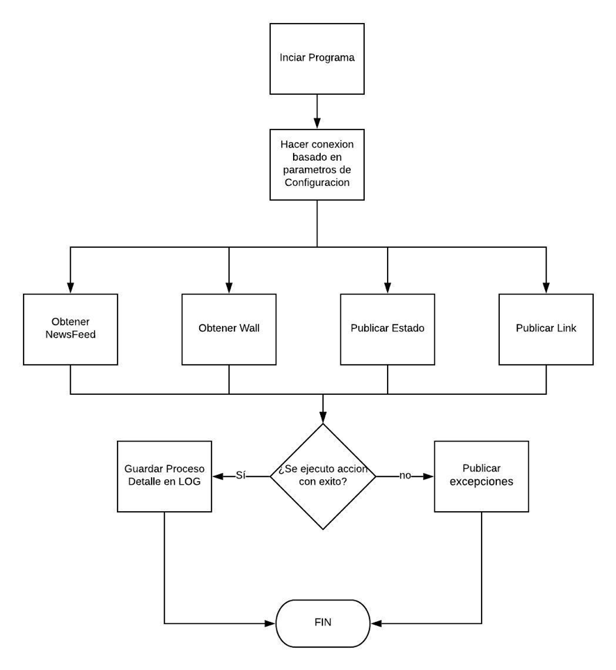

# FbCMD4j

Facebook CLI client. For educational purposes only.

Acerca de: Esta es una aplicacion cliente de Facebook, corre en JAVA y tiene 4 diferentes opciones Publicar , Publicar con URL, Traer Home, Traer Feed.

Proyecto: Existen 2 diferentes Clases, Una encargada de correr el programa y otra de hacer todo el trabajo de cliente con Facebook. 

Este es el diagrama de la aplicacion:

Guías: Para configurar la Aplicacion debemos ir a la Clase FacebookIMP, donde veremos que se utilizan 3 claves

2 de ellas te las proporciona Facebook, otra de ellas tu la generaras dependiendo los permisos que solicitaras a tu usuario.

